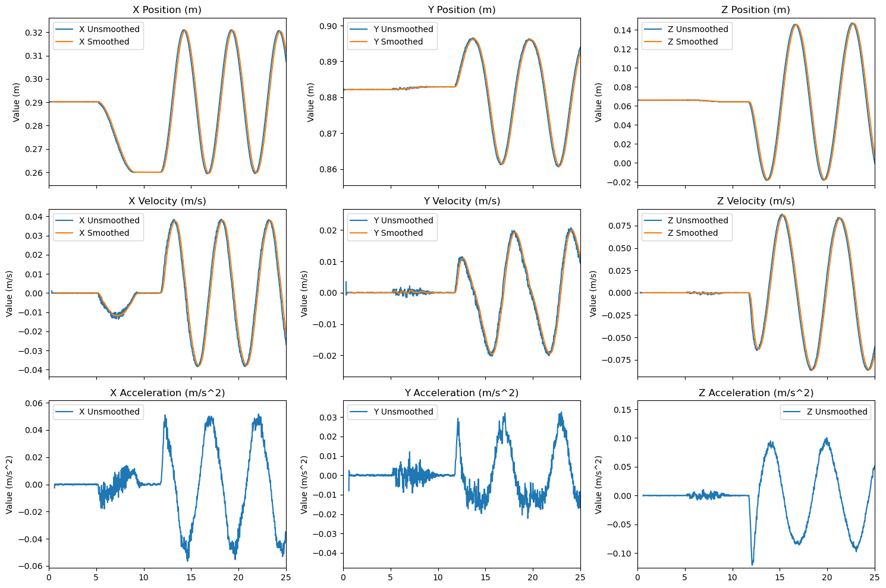
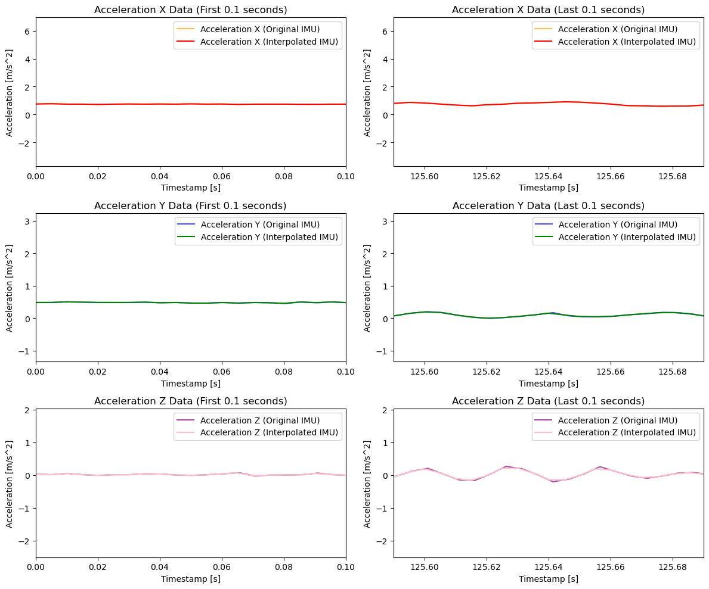

# TLIO Data Loader for IMU and MOCAP

This github repo contains the code for a data loader built to format the IMU and MOCAP data to be usable in the <a href="https://github.com/CathIAS/TLIO">TLIO</a> model.

[Naming Convention](naming-convention)
[MOCAP Data Transform](#mocap-data-transform)  
[IMU Data Transform](#imu-data-transform)  
[IMU Interpolation](#imu-interpolation-and-alignment)
[Data Time Alignment](#data-time-alignment)
[Create Calibration Files](#create-calibration-files)
[Create Data Batches](#create-data-batches)  

*For all the code run, manually go in and change the input/output directories as needed.

## Naming Convention
### Ground Truth naming Convention
Ensure to name all of the ground truth data following the structure : "Train_data_##.csv" (where the ## is the trial number)

Also ensure that the MOCAP data is saved as a .csv file

### IMU Naming convention:
The IMU data pipeline generates a folder from the software. Ensure to name the resulting folder as follows :"Train_Data_##_IMU" (where ## is the trial number)

The folder will contain n (the number of IMU's) .csv, .wplay, and 1 Matlab folder. Double check to ensure
you have three separate csv files each IMU - the IMU pipeline default is to combine all the active IMU's into
one csv file

Run the "renameCurrent.py" to properly assign each IMU its name (not the default names) if not already done.

You may have to go into the code and change the names based on the experiment

## MOCAP Data Transform
Run the "groundTruthFormat.py" to convert the MOCAP to the TLIO format.If you want to verify the plots run the ipynb file instead

It is important to note that the ground truth data processing has a smoothing filter applied. Please do go and alter this as per the application it is intended for. This can be done by increasing or decreasing the magnitude of the variable "window_size" in "groundTruthFormat.py". An example can be seen below

## IMU Data Transform
Run the "imuFormat.py" to convert the IMU data to the TLIO format

## IMU Interpolation
The Extended Kalman Filter in the TLIO requires an IMU frequency of 200 hz. The IMU interpolation code ensures that this holds true. The code is helpful especially when IMU's don't have set frequencies or lower frequencies

To carry out this operation, run the file "interpolateIMU.py". To verify the plots run the .ipynb file instead. An example can be seen below.

## Data Time Alignment
The IMU and ground truth data are often time unaligned due to when the button to start recording is pressed. The starting and ending times need to be chosen through an interactive graph

To match the starting and ending times, run "matchTimeV2.py"
1) A 3x2 plot will show the acceleration in all three directions for the first and last 10 seconds for each data set
2) Make sure to pick the start and end times of the experiment from row that has the clearest indication of the same. A time can be picked by clicking on a point in the graph
3) First pick the ground truth start time and then the ground truth end time
4) Then pick the IMU start time
5) The algined data set will then be presented on the same graph. enter "y" if you wish to proceed to the next data set or "n" if you wish to re-do the alignment of the current dataset

Before and After time alignment for a dataset:

Run the "verifyAlignment.ipynb" file to double check the alignment for all the files.

If you want to go back and change any alignment open the "matchTimeV2.py" file and follow these steps.

1) Change "folder_count" to the trial number that you want to change + 2 instead of  ">=0".
2) Keep pressing "y" until a plot pops up.
3) Re-do the alignment for the dataset you want and then press "y" when its satisfactory
Press "Ctrl+C" and press enter to terminate the script

## Create Calibration Files
Run the "creatCalibration.py" file to make the JSON file containing the initial states of the IMU and the ground truth

## Create Data Batches
Run the "createTxt.py" to assign create the training, test, validation split of the formatted data in an organized manner - in which the most of the more complicated motion profiles are in the train batch

Run the "createTxt_rand.py" to assign create the training, test, validation split of the formatted data in a random manner - following 60%-20%-20% train-test-val split.